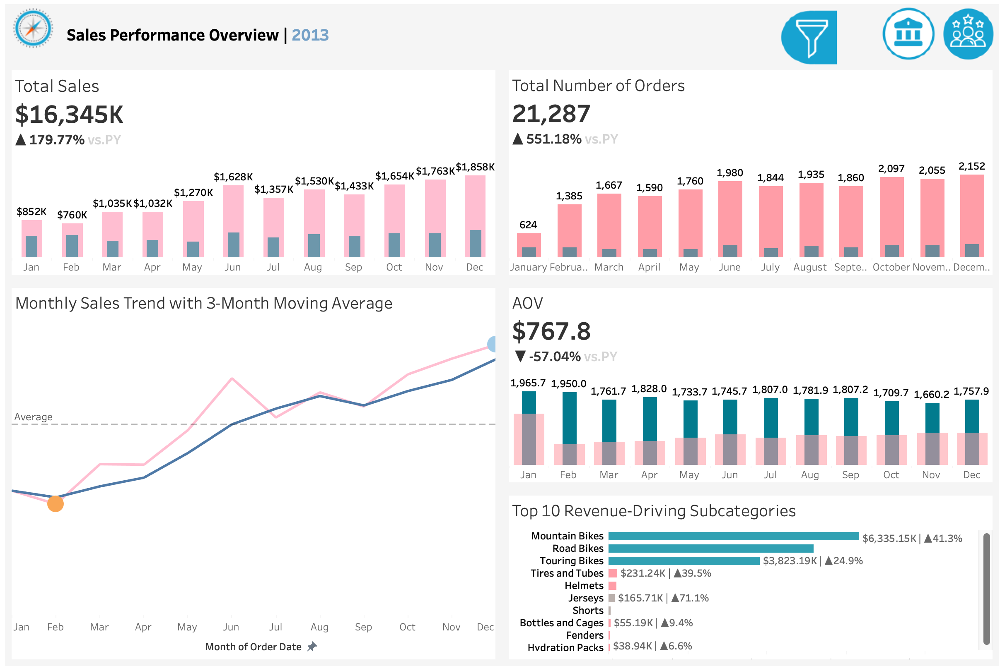

# Tableau Dashboard

This Tableau dashboard was built on top of the Gold Layer of the SQL Server data warehouse project.  
It uses business-ready fact and dimension tables to analyze sales performance, customer behavior, market distribution, and product performance.

## Dashboard Objectives

- Track key business KPIs, including revenue, orders, customers, and average order value
- Analyze monthly sales momentum using trend lines and moving averages
- Identify top revenue-driving product subcategories and products
- Understand customer value segments and country-level revenue distribution
- Compare product performance using quantity sold, average selling price, and revenue contribution

## Data Source

The dashboard is based on the Gold Layer of the data warehouse:

- `gold.fact_sales`
- `gold.dim_customers`
- `gold.dim_products`

The Tableau workbook uses exported CSV files from the Gold Layer.

## Dashboard 1: Sales Performance Overview

This dashboard provides an executive-level summary of selected-year sales performance.

Main components:

- Total Sales KPI with year-over-year comparison
- Total Orders KPI with year-over-year comparison
- Average Order Value KPI
- Monthly Sales Trend with 3-Month Moving Average
- Top 10 Revenue-Driving Subcategories

## Dashboard 2: Customer & Product Performance Analysis

This dashboard provides a deeper analysis of customer behavior, market distribution, and product performance.

Main components:

- Monthly Revenue by Customer Value Segment
- Revenue Contribution by Country
- Non-Bike Product Performance Matrix
- Top Products by Revenue with current vs. previous year comparison

## Key Insights

- Selected-year sales increased strongly compared with the previous year.
- Monthly revenue showed a clear upward trend throughout the year.
- Regular customers contributed the largest share of monthly revenue, while high-value customers provided additional revenue lift.
- Revenue was concentrated in several key countries, including the United States and Australia.
- Top revenue-generating products were mainly bike products, especially Mountain Bikes.
- Non-bike products showed different performance patterns based on quantity sold, average selling price, and revenue contribution.

## Tools Used

- SQL Server
- Tableau
- CSV exports from the Gold Layer
- Data warehouse star schema
- KPI analysis
- Customer segmentation
- Product performance analysis

## Workbook

The packaged Tableau workbook is available here:

[Download Tableau Packaged Workbook](workbook/bike_retail_dashboard.twbx)
